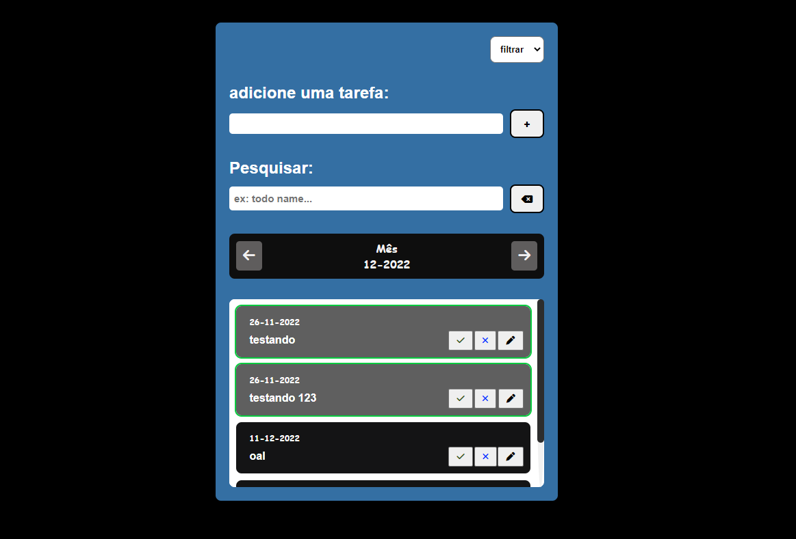
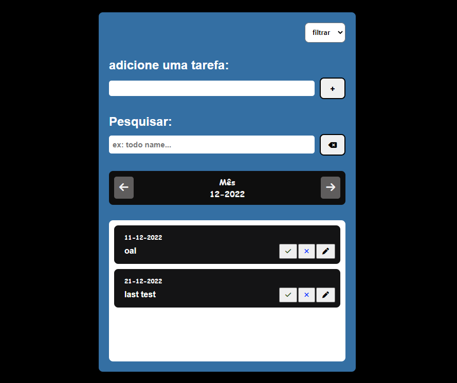
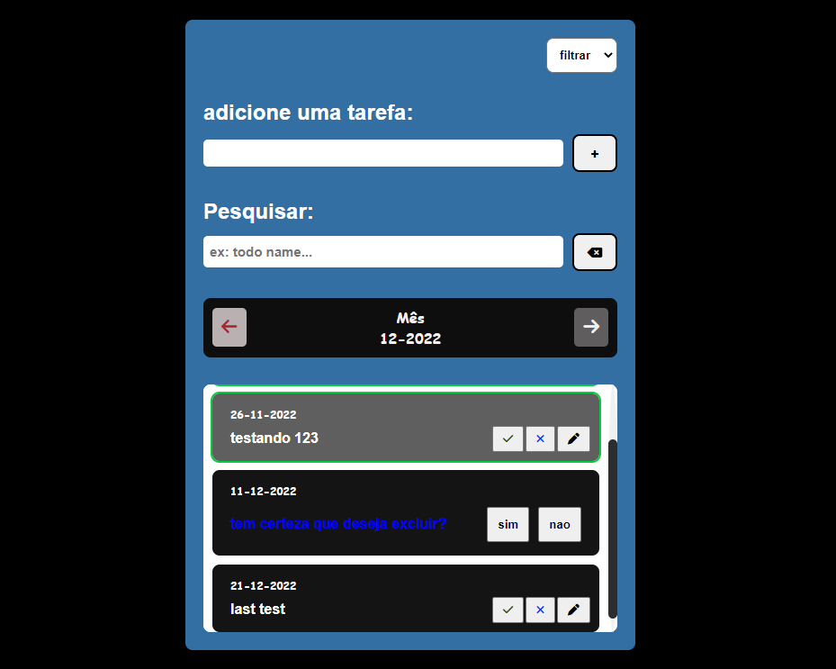
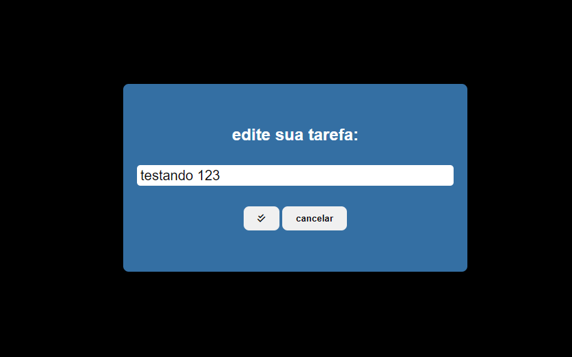

<h1 align="center">
  To-do list avançado
</h1>

  

## 💻 Descrição

Projeto CRUD, feito com html, css e javascript, o projeto tem o intuito de criar tarefas, com algumas funcionalidades, como filtrar atividades feitas, pesquisar uma tarefa especifica, filtragem pelo mês em que foi criada, verificar no "DB" se ja existe uma tarefa com o mesmo nome criada, editar tarefas e etc. Colocando em pratica conhecimentos de manipulação de Dom, requisições e validações com localStorage atraves de funções.

## ➜ imagens de algumas funcionalidades descritas:

  

  

  

  

  

